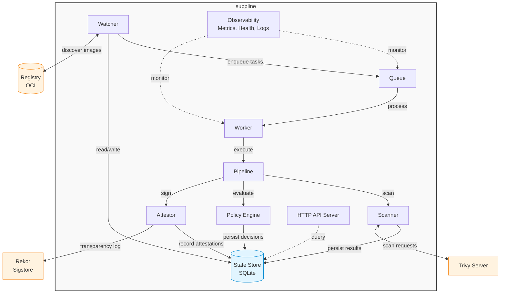

<p align="center">
  
</p>

A cloud-native container security pipeline that continuously monitors container registries, scans images for vulnerabilities, generates attestations, and signs compliant images using Sigstore.

## What is suppline?

suppline automates container security workflows by:

1. **Discovering** container images from your private registry using regsync configuration
2. **Scanning** images with Trivy to identify vulnerabilities and generate SBOMs
3. **Evaluating** security policies with CVE toleration support
4. **Attesting** scan results using in-toto SCAI format
5. **Signing** compliant images with Sigstore/Cosign

Built as a single Go binary, suppline runs as a continuous service that watches your registry and maintains a complete audit trail of your container security posture.

*suppline* uses the regsync format with suppline-specific extensions. Isn't that great? You can use *regsync* to synchronize other repositories to your private one and *suppline* to assure compliance there. Using a simple *kyverno* or *OPA* policy in your cluster you can always be sure that only vulnerability-checked, compliant images are running.

## Key Features

- **Automated Discovery**: Monitors registries using regsync configuration format
- **Conditional Scanning**: Smart rescan logic based on digest changes and time intervals
- **CVE Tolerations**: Accept specific vulnerabilities with expiry dates and audit statements
- **Policy Engine**: Flexible CEL-based policies with per-repository overrides
- **SCAI Attestations**: Standards-compliant security attestations (in-toto SCAI v0.3)
- **Sigstore Integration**: Keyless or key-based signing with transparency log support
- **State Tracking**: SQLite-based persistence for scan history and vulnerability records
- **REST API**: Query scan results, trigger rescans, and manage policies
- **Observability**: Prometheus metrics, structured logging, and health checks

## Architecture

suppline consists of several components running in a single process:



### Component Responsibilities

- **Watcher**: Polls registry for new/updated images, checks scan history, enqueues tasks
- **Queue**: In-memory task queue with retry and failure tracking
- **Worker**: Processes scan tasks through the pipeline
- **Pipeline**: Orchestrates scan → policy → attest → sign workflow
- **Scanner**: Integrates with Trivy for vulnerability scanning and SBOM generation
- **Policy Engine**: Evaluates CEL expressions with CVE toleration support
- **Attestor**: Creates and signs in-toto attestations using Sigstore
- **State Store**: Persists scan records, vulnerabilities, and policy decisions
- **API Server**: REST endpoints for querying and triggering operations

## Quick Start

### Prerequisites

- Docker and Docker Compose
- Container registry credentials
- Cosign key pair (or use keyless mode)

### 1. Create Configuration

```bash
# Copy example configuration
cp suppline.yml.example suppline.yml

# Edit with your registry details
vim suppline.yml
```

Example `suppline.yml`:

```yaml
version: 1

creds:
  - registry: docker.io
    user: myuser
    pass: mypassword
    repoAuth: true

defaults:
  parallel: 2
  x-rescanInterval: 7d
  x-policy:
    expression: "criticalCount == 0"
    failureMessage: "critical vulnerabilities found"

sync:
  - source: nginx
    target: myregistry/nginx
    type: repository
    x-tolerate:
      - id: CVE-2024-56171
        statement: "Accepted risk - no fix available"
        expires_at: 2025-12-31T23:59:59Z
```

### 2. Generate Signing Keys

```bash
mkdir -p keys
cosign generate-key-pair
mv cosign.key keys/
```

### 3. Start Services

```bash
docker compose up -d
```

### 4. Verify Operation

```bash
# Check health
curl http://localhost:8081/health

# View logs
docker compose logs -f suppline

# Check metrics
curl http://localhost:9090/metrics
```

## Configuration

### Environment Variables

suppline is configured through environment variables and the suppline.yml config file:

#### Core Configuration
```bash
SUPPLINE_CONFIG=suppline.yml          # Path to regsync config
LOG_LEVEL=info                        # debug, info, warn, error
```

#### Queue & Worker
```bash
QUEUE_BUFFER_SIZE=1000                # Task queue capacity
WORKER_POLL_INTERVAL=5s               # How often worker checks queue
WORKER_RETRY_ATTEMPTS=3               # Max retries for transient failures
WORKER_RETRY_BACKOFF=10s              # Initial retry backoff (exponential)
```

#### Scanner (Trivy)
```bash
TRIVY_SERVER_ADDR=localhost:4954      # Trivy server address
TRIVY_TOKEN=                          # Optional auth token
TRIVY_TIMEOUT=5m                      # Scan timeout
TRIVY_INSECURE=false                  # Skip TLS verification
```

#### State Store
```bash
STATE_STORE_TYPE=sqlite               # sqlite, postgres, memory
SQLITE_PATH=suppline.db               # SQLite database path
RESCAN_INTERVAL=24h                   # Default rescan interval
```

#### Attestation & Signing
```bash
ATTESTATION_KEY_PATH=/keys/cosign.key # Path to Cosign private key
ATTESTATION_KEY_PASSWORD=             # Key password (if encrypted)
REKOR_URL=https://rekor.sigstore.dev  # Transparency log URL
```

#### API Server
```bash
API_ENABLED=true                      # Enable HTTP API
API_PORT=8080                         # API server port
API_KEY=                              # Optional API key for auth
API_READ_ONLY=false                   # Disable write operations
```

#### Observability
```bash
METRICS_PORT=9090                     # Prometheus metrics port
HEALTH_CHECK_PORT=8081                # Health check port
```

### Regsync Configuration Format

The `suppline.yml` file uses the regsync format with suppline-specific extensions. 

```yaml
version: 1

# Registry credentials
creds:
  - registry: docker.io
    user: username
    pass: password
    repoAuth: true
    reqPerSec: 100
    reqConcurrent: 5

# Default settings for all sync entries
defaults:
  parallel: 2
  x-rescanInterval: 7d                # How often to rescan unchanged images
  x-policy:                           # Default policy
    expression: "criticalCount == 0"
    failureMessage: "critical vulnerabilities found"

# Repositories to monitor
sync:
  # Repository sync - monitors all tags
  - source: nginx
    target: myregistry/nginx
    type: repository
    schedule: "0 */6 * * *"           # Optional cron schedule
    x-rescanInterval: 3d              # Override default
    x-policy:                         # Override default policy
      expression: "criticalCount == 0 && highCount < 5"
      failureMessage: "too many vulnerabilities"
    x-tolerate:                       # CVE tolerations
      - id: CVE-2024-56171
        statement: "Accepted risk - no fix available"
        expires_at: 2025-12-31T23:59:59Z
      - id: CVE-2025-0838
        statement: "False positive in our use case"
        # No expires_at = permanent toleration

  # Image sync - monitors specific tags
  - source: alpine:3.18
    target: myregistry/alpine:3.18
    type: image
    x-tolerate:
      - id: CVE-2024-12345
        statement: "Waiting for upstream fix"
        expires_at: 2025-06-30T23:59:59Z
```

### CVE Toleration

Tolerations allow you to accept specific CVEs with audit trails:

- **id**: CVE identifier (required)
- **statement**: Reason for acceptance (required, for audit)
- **expires_at**: RFC3339 timestamp (optional, permanent if omitted)

**Behavior:**
- Tolerated CVEs are excluded from policy evaluation
- Expired tolerations are treated as if they don't exist
- Warnings logged for tolerations expiring within 7 days
- All tolerations recorded in SCAI attestations

### Policy Engine

Policies use CEL (Common Expression Language) with these variables:

- `criticalCount` - Number of critical vulnerabilities (excluding tolerated)
- `highCount` - Number of high vulnerabilities (excluding tolerated)
- `mediumCount` - Number of medium vulnerabilities (excluding tolerated)
- `lowCount` - Number of low vulnerabilities (excluding tolerated)
- `toleratedCount` - Number of tolerated vulnerabilities
- `vulnerabilities` - List of all vulnerabilities with details
- `imageRef` - Image reference being evaluated

**Example Policies:**

```yaml
# No critical vulnerabilities
expression: "criticalCount == 0"

# No critical or high vulnerabilities
expression: "criticalCount == 0 && highCount == 0"

# Allow up to 5 high vulnerabilities
expression: "criticalCount == 0 && highCount <= 5"

# Complex policy with vulnerability details
expression: |
  criticalCount == 0 && 
  vulnerabilities.filter(v, v.severity == 'HIGH' && v.fixedVersion == '').size() == 0
```

## API Reference

### Query Endpoints

#### Get Scan Record
```bash
GET /api/v1/scans/{digest}

# Example
curl http://localhost:8080/api/v1/scans/sha256:abc123...
```

#### List Scans
```bash
GET /api/v1/scans?repository=nginx&limit=10

# Query parameters:
# - repository: filter by repository
# - limit: max results (default 100)
# - offset: pagination offset
```

#### Search Vulnerabilities
```bash
GET /api/v1/vulnerabilities?cve_id=CVE-2024-56171

# Query parameters:
# - cve_id: filter by CVE ID
# - severity: filter by severity (CRITICAL, HIGH, MEDIUM, LOW)
# - repository: filter by repository
```

#### List Tolerations
```bash
GET /api/v1/tolerations

# Returns all active tolerations with expiry information
```

#### List Failed Images
```bash
GET /api/v1/images/failed

# Returns images that failed policy evaluation
```

### Action Endpoints

#### Trigger Rescan
```bash
POST /api/v1/scans/trigger
Content-Type: application/json

{
  "digest": "sha256:abc123...",
  "repository": "nginx"
}

# Trigger rescan of specific digest or all images in repository
```

#### Reload Policy
```bash
POST /api/v1/policy/reevaluate

# Reloads suppline.yml and re-evaluates all scans
```

### Observability Endpoints

#### Health Check
```bash
GET /health

# Returns component health status
{
  "status": "healthy",
  "components": {
    "config": "healthy",
    "queue": "healthy",
    "worker": "healthy",
    "trivy": "healthy",
    "database": "healthy",
    "watcher": "healthy"
  }
}
```

#### Metrics
```bash
GET /metrics

# Prometheus metrics including:
# - suppline_scans_total
# - suppline_policy_passed_total
# - suppline_queue_depth
# - suppline_vulnerabilities_total
# - suppline_conditional_scan_decisions_total
```

## Deployment

### Docker Compose (Development)

```bash
# Start all services
docker compose up -d

# View logs
docker compose logs -f

# Stop services
docker compose down
```

### Kubernetes (Production)

```bash
# Create namespace and secrets
kubectl create namespace suppline

# Create signing key secret
kubectl create secret generic suppline-signing-key \
  --namespace=suppline \
  --from-file=cosign.key=keys/cosign.key

# Create config secret
kubectl create secret generic suppline-config \
  --namespace=suppline \
  --from-file=suppline.yml=suppline.yml

# Deploy
kubectl apply -k deploy/kubernetes/

# Check status
kubectl get pods -n suppline
kubectl logs -n suppline -l app=suppline -f

# Port forward for local access
kubectl port-forward -n suppline svc/suppline 8080:8080 9090:9090 8081:8081
```

### Standalone Binary

```bash
# Build
make build

# Run Trivy server
trivy server --listen localhost:4954 &

# Run suppline
export SUPPLINE_CONFIG=suppline.yml
export ATTESTATION_KEY_PATH=keys/cosign.key
./suppline
```

## Development

### Prerequisites

- Go 1.24+
- Docker and Docker Compose
- Cosign CLI
- Make

### Setup

```bash
# Install dependencies
make deps

# Install development tools
make dev-setup

# Run tests
make test

# Run integration tests
make test-integration

# Build
make build

# Run locally
make run
```

### Project Structure

```
.
├── cmd/
│   └── suppline/           # Main application entry point
├── internal/
│   ├── api/                # HTTP API server and handlers
│   ├── attestation/        # Sigstore attestation and signing
│   ├── config/             # Configuration loading and regsync parsing
│   ├── errors/             # Error classification (transient/permanent)
│   ├── observability/      # Metrics, logging, health checks
│   ├── policy/             # CEL-based policy engine
│   ├── queue/              # In-memory task queue
│   ├── registry/           # OCI registry client
│   ├── scanner/            # Trivy integration
│   ├── statestore/         # SQLite persistence layer
│   ├── types/              # Shared types and converters
│   ├── watcher/            # Registry monitoring and discovery
│   └── worker/             # Task processing and pipeline
├── deploy/
│   └── kubernetes/         # Kubernetes manifests
├── test/
│   └── integration/        # Integration tests
├── docker-compose.yml      # Local development setup
├── Dockerfile              # Production container image
├── Makefile                # Build automation
└── suppline.yml.example    # Example configuration
```

### Testing

```bash
# Unit tests
make test-unit

# Integration tests (requires Docker)
make test-integration

# Test authentication
make test-auth

# All tests
make test-all

# With coverage
go test -v -race -coverprofile=coverage.txt -covermode=atomic ./...
```

### Make Targets

```bash
make help                   # Show all available targets
make build                  # Build binary
make test                   # Run unit tests
make test-integration       # Run integration tests
make docker-build           # Build Docker image
make docker-run             # Run with Docker Compose
make k8s-deploy             # Deploy to Kubernetes
make swagger                # Generate API documentation
make lint                   # Run linters
make fmt                    # Format code
```

## Monitoring

### Prometheus Metrics

Key metrics exposed on `:9090/metrics`:

- `suppline_scans_total{status}` - Total scans by status (success/failure)
- `suppline_policy_passed_total` - Images passing policy
- `suppline_policy_failed_total` - Images failing policy
- `suppline_queue_depth` - Current task queue depth
- `suppline_vulnerabilities_total{severity}` - Vulnerabilities by severity
- `suppline_conditional_scan_decisions_total{decision,reason}` - Scan decisions
- `suppline_conditional_scan_enqueued_total{repository,reason}` - Enqueued scans
- `suppline_conditional_scan_skipped_total{repository}` - Skipped scans
- `suppline_scan_duration_seconds` - Scan duration histogram

### Structured Logging

All logs are JSON-formatted with structured fields:

```json
{
  "time": "2025-11-14T10:30:00Z",
  "level": "INFO",
  "msg": "task processing completed",
  "task_id": "sha256:abc123-1731582600",
  "digest": "sha256:abc123...",
  "repository": "nginx",
  "critical": 0,
  "high": 2,
  "tolerated": 1
}
```

### Health Checks

Health endpoint returns component status:

```bash
curl http://localhost:8081/health
```

Components monitored:
- Configuration loading
- Task queue
- Worker processing
- Trivy connectivity
- Database connection
- Registry watcher

## Troubleshooting

### Common Issues

**Trivy connection failed**
```bash
# Check Trivy server is running
curl http://localhost:4954/healthz

# Check network connectivity
docker compose logs trivy
```

**Authentication errors**
```bash
# Verify registry credentials in suppline.yml
# Check cosign authentication
cosign login docker.io -u username -p password
```

**Database locked**
```bash
# SQLite doesn't support concurrent writes well
# Consider using PostgreSQL for high-throughput scenarios
# Or ensure only one suppline instance per database
```

**Queue filling up**
```bash
# Check worker is processing tasks
curl http://localhost:8081/health

# Increase worker poll interval
export WORKER_POLL_INTERVAL=10s

# Increase queue buffer size
export QUEUE_BUFFER_SIZE=2000
```

### Debug Mode

Enable debug logging for detailed information:

```bash
export LOG_LEVEL=debug
./suppline
```

## Security Considerations

- **Private Keys**: Store Cosign keys securely (Kubernetes secrets, vault)
- **API Authentication**: Use `API_KEY` environment variable for production
- **Registry Credentials**: Never commit credentials to version control
- **TLS**: Enable TLS for Trivy server in production (`TRIVY_INSECURE=false`)
- **Network Policies**: Restrict network access in Kubernetes deployments
- **RBAC**: Use minimal permissions for service accounts

## Roadmap

- [ ] PostgreSQL state store implementation
- [ ] Keyless signing support (OIDC)
- [ ] Web UI for visualization
- [ ] Slack/webhook notifications
- [ ] Multi-architecture image support
- [ ] Custom scanner plugins
- [ ] Policy templates library
- [ ] Compliance reporting (CIS, NIST)

## Contributing

Contributions welcome! Please:

1. Fork the repository
2. Create a feature branch
3. Add tests for new functionality
4. Ensure all tests pass (`make test-all`)
5. Submit a pull request

## License

See LICENSE file for details.

## Documentation

- **API Reference** - live swagger doc, simply browse directly to http://localhost:8080/swagger
- **[Configuration Guide](docs/CONFIGURATION.md)** - All environment variables and regsync format
- **[Policy Guide](docs/POLICY.md)** - CEL-based policy configuration and examples

## Support

- **Issues**: https://github.com/daimoniac/suppline/issues
- **Examples**: See `suppline.yml.example` and `deploy/` directory
