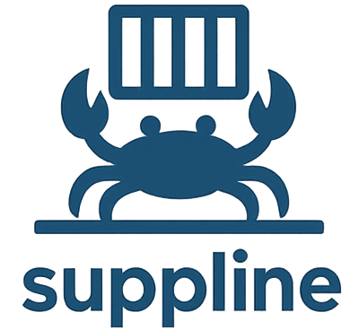
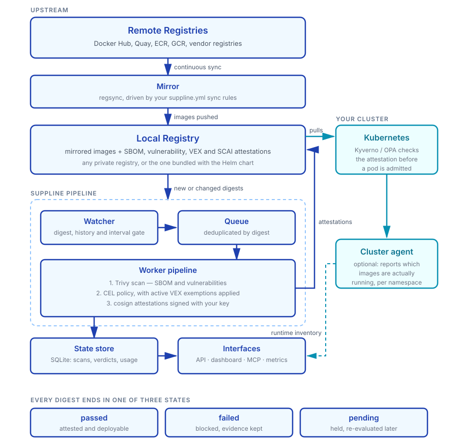
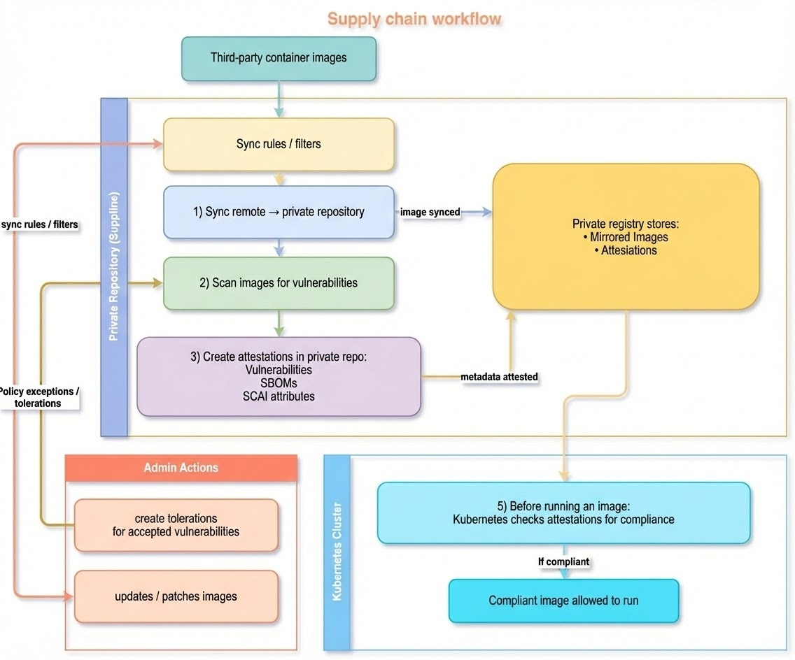

<p align="center">
  
</p>

<p align="center">
  <strong>Self-hosted image intake gateway for Kubernetes.</strong><br/>
  Mirror → Scan → Gate → Attest → Run.
</p>

<p align="center">
  <a href="LICENSE"></a>
  
  
  <a href="https://suppline.cloud"></a>
</p>

---

Your cluster runs dozens of third-party images you didn't build. Every one of them is a pull from someone else's registry, on someone else's uptime, with a CVE list nobody reviewed since the day it was deployed.

suppline is the gate in front of that. **Stop maintaining supply-chain glue** — mirror, scan, policy, and cosign attestations in one system, and admit only what passed. Your clusters then pull only from the mirror — and can refuse to run anything without a valid, fresh attestation.

One Go binary. SQLite state. No SaaS, no phone-home, air-gap compatible by design.

**Used in production at [SocialHub](https://www.socialhub.io)** to gate third-party images before admission.

## Why you might want this

- **Your cluster stops depending on Docker Hub.** Upstream outage, rate limit, or a deleted tag no longer breaks a deploy.
- **Every third-party image gets reviewed — continuously.** Not once at onboarding. Digests are rescanned on an interval, and new upstream tags enter the same gate automatically.
- **Policy is code, not a wiki page.** CEL expressions per repository, with expiring VEX exemptions instead of permanent "we accepted that one" tribal knowledge.
- **The verdict is cryptographic.** Kyverno or OPA verifies a cosign attestation at admission time, so the gate holds even if suppline is down.
- **You can answer the audit question.** Which images fail policy, which of those are actually running in production, and what was known at the time — all in your own database.

## How it works

<p align="center">
  
</p>

1. **Mirror** — regsync keeps your registry in sync with the upstream repositories listed in `suppline.yml`.
2. **Scan** — the watcher notices new or changed digests and enqueues them; Trivy produces an SBOM and vulnerability set.
3. **Gate** — active VEX statements are applied, then your CEL policy decides: `passed`, `failed`, or `pending`.
4. **Attest** — cosign signs SBOM, vulnerability, VEX, and SCAI attestations into the registry next to the image.
5. **Run** — clusters pull from the mirror; Kyverno/OPA verifies the SCAI attestation before a pod starts.

See [docs/STATE_MACHINE.md](docs/STATE_MACHINE.md) for the exact lifecycle, including rescan triggers and error paths.

<details>
<summary>The same flow, with the admin loop drawn in</summary>

<p align="center">
  
</p>

</details>

## Quick start

Zero credentials. Compose brings up a throwaway registry, Trivy, regsync, suppline, and the UI. One demo image **passes** (with attestations); one **fails**.

```bash
git clone https://github.com/daimoniac/suppline.git && cd suppline
docker compose up --build -d
```

Open **http://localhost:3000** and log in with API key **`demo`**. First boot needs a few minutes for image pulls and Trivy’s DB.

```bash
curl http://localhost:8081/health
curl -H "Authorization: Bearer demo" http://localhost:8080/api/v1/scans
```

Full checklist, Hub escape hatch, attestation gate POC, and “you’re done when…”: **[docs/EVAL.md](docs/EVAL.md)**.

After scans finish, prove the admit/deny gate without a cluster:

```bash
docker compose --profile eval-gate run --rm eval-gate
```

| Port | Service |
|------|---------|
| 3000 | Web UI (API key `demo`) |
| 8080 | REST API + Swagger |
| 8081 | Health checks |
| 5000 | Throwaway registry (localhost) |
| 9090 | Prometheus metrics |
| 4954 | Trivy server |

For a production-shaped Compose/Helm install (BYO registry, your keys, real policy), see [Deploy](#deploy) and `suppline.yml.example` / `env.example`.

## Configuration

`suppline.yml` is a [regsync](https://github.com/regclient/regclient) config with `x-` extensions, so mirroring rules and security policy live in one file. Go template expansion runs before YAML parsing, which keeps secrets out of the file.

```yaml
version: 1

creds:
  - registry: docker.io
    user: '{{ env "DOCKER_USERNAME" }}'
    pass: '{{ env "DOCKER_PASSWORD" }}'
  - registry: myregistry.com
    user: '{{ env "MYREGISTRY_USERNAME" }}'
    pass: '{{ env "MYREGISTRY_PASSWORD" }}'

defaults:
  parallel: 2
  x-rescanInterval: 7d              # rescan unchanged digests this often
  x-runtimeInUseWindow: 60m         # how recently seen counts as "running"
  x-policy:
    expression: "criticalCount == 0"
    failureMessage: "critical vulnerabilities found"

sync:
  - source: nginx
    target: myregistry.com/nginx
    type: repository                # all tags; use "image" for one tag
    x-policy:                       # per-repository override
      expression: "criticalCount == 0 && highCount <= 5"
    x-vex:
      - id: CVE-2024-56171
        state: not_affected
        justification: vulnerable_code_not_present
        detail: "Not reachable in our configuration"
        expires_at: 2026-12-31T23:59:59Z
```

Runtime behaviour is set with environment variables — `SUPPLINE_CONFIG`, `TRIVY_SERVER_ADDR`, `SQLITE_PATH`, `ATTESTATION_KEY`, `SUPPLINE_API_KEY`, `LOG_LEVEL`, and the worker/queue tunables. Full list in [docs/CONFIGURATION.md](docs/CONFIGURATION.md).

## Policy as code

Policies are [CEL](https://github.com/google/cel-spec) expressions evaluated against the scan result. Counts exclude VEX-exempted CVEs.

```yaml
# each line is an alternative for x-policy.expression
expression: "criticalCount == 0"                        # block criticals
expression: "criticalCount == 0 && highCount == 0"      # block criticals and highs
expression: "criticalCount == 0 && highCount <= 5"      # budget for highs

# Only block criticals that actually have a fix available
expression: |
  vulnerabilities.filter(v,
    v.severity == "CRITICAL" && v.fixedVersion != "" && !v.exempted
  ).size() == 0
```

Available variables: `criticalCount`, `highCount`, `mediumCount`, `lowCount`, `exemptedCount`, `vulnerabilities`, `imageRef`.

A policy can also refuse to judge an image that is too fresh to trust — useful against compromised upstream releases that get pulled within hours:

```yaml
x-policy:
  expression: "criticalCount == 0"
  minimumReleaseAge: 72h    # hold in "pending", no attestation, re-evaluated later
```

VEX statements are CycloneDX-style exemptions with a state, justification, detail, and **expiry** — so an accepted risk resurfaces instead of silently living forever. Expiring statements are logged and listed at `/api/v1/vex/inactive`. More in [docs/POLICY.md](docs/POLICY.md).

## Enforce it in the cluster

suppline generates a ready-to-apply Kyverno policy from the public key it signs with:

```bash
curl -s http://localhost:8080/api/v1/integration/kyverno/policy > suppline-policy.yaml
kubectl apply -f suppline-policy.yaml
```

The generated `ClusterPolicy` verifies the SCAI attestation on every pod image and admits it only when `scanStatus` is `passed` (or passed with exceptions) **and** the attestation has not expired — so a stale verdict fails closed. It starts in `Audit` mode; switch `validationFailureAction` to `Enforce` when you're ready.

Verify any attestation by hand:

```bash
cosign verify-attestation \
  --type https://in-toto.io/attestation/scai/attribute-report/v0.3 \
  --key keys/cosign.pub --insecure-ignore-tlog \
  myregistry.com/nginx:1.27 | jq -r .payload | base64 -d | jq
```

suppline also publishes `cyclonedx` (SBOM) and `vuln` attestations for every digest.

## Know what's actually running

A failing image nobody deployed is a backlog item. A failing image in production is an incident. The optional [clusterstate-agent](clusterstate-agent/) reports pod and workload image inventory from each cluster to suppline, so scans, repositories, and the UI can be filtered by real runtime usage — and `suppline_policy_failed_current{source="runtime"}` tells you how many failures are live.

```bash
helm install clusterstate-agent ./clusterstate-agent/chart \
  --namespace suppline \
  --set clusterName=prod-eu-1 \
  --set suppline.url=http://suppline.suppline.svc.cluster.local:8080
```

## Ask your supply chain questions

`suppline-mcp` is a [Model Context Protocol](https://modelcontextprotocol.io/) server wrapping the REST API, so an LLM client can answer things like *"which images currently deployed to prod fail policy?"* or *"do we have expired VEX statements?"*.

```bash
make build-mcp
suppline-mcp --transport stdio    # or: --transport http --addr :8082 --mount /mcp
```

Read-only by default (`list_scans`, `list_failed_images`, `query_vulnerabilities`, `list_repositories`, `get_cluster_images`, …); `--allow-writes` adds `trigger_rescan` and `reevaluate_policy`.

## Deploy

**Docker Compose (eval)** — throwaway registry, zero credentials (see [docs/EVAL.md](docs/EVAL.md)):

```bash
docker compose up --build -d && docker compose logs -f suppline
```

**Kubernetes (production)** — Helm chart; **bring-your-own registry** by default (see [docs/REGISTRY.md](docs/REGISTRY.md)):

```bash
cp charts/suppline/values-secrets.yaml.example charts/suppline/values-secrets.yaml
# Set SUPPLINE_API_KEY, ATTESTATION_KEY*, SUPPLINE_REGISTRY_*, upstream creds
# Override sync/policy via backend.supplineConfig or edit charts/suppline/suppline.yml

helm upgrade --install suppline charts/suppline \
  -n suppline --create-namespace \
  -f charts/suppline/values.yaml \
  -f charts/suppline/values-secrets.yaml
```

Need raw YAML instead of applying with Helm? `helm template … > manifests.yaml` — there is no separate Kustomize tree.

**Standalone binary** — CGO is required for SQLite, so you need a C toolchain:

```bash
make build
trivy server --listen localhost:4954 &
export SUPPLINE_CONFIG=suppline.yml
export TRIVY_SERVER_ADDR=localhost:4954
export ATTESTATION_KEY=$(base64 -w0 keys/cosign.key)
export ATTESTATION_KEY_PASSWORD=<cosign password>
./suppline
```

## Observability

Prometheus metrics on `:9090/metrics`, JSON logs on stdout, component health on `:8081/health` (config, queue, worker, trivy, database, watcher).

| Metric | Tells you |
|--------|-----------|
| `suppline_policy_failed_current{source="registry\|runtime"}` | Failing images, split by mirrored vs actually running |
| `suppline_vulnerabilities_total` | Vulnerabilities by severity |
| `suppline_scans_total` | Scans by status |
| `suppline_queue_depth` | Backlog — if this climbs, add workers or slow the watcher |
| `suppline_scan_duration_seconds` | Scan latency histogram |

A starter Grafana dashboard lives in [grafana/](grafana/).

## Development

```bash
make dev-setup          # deps + tooling
make build              # regenerates swagger, then builds
make test               # unit tests
make test-integration   # integration tests (needs Docker Compose)
make lint fmt vet
```

```
cmd/suppline/          Service entry point
internal/
  watcher/             Registry polling and scan decisions
  queue/               Task queue with digest dedup
  worker/              Pipeline: scan → policy → attest → persist
  scanner/             Trivy integration
  policy/              CEL engine and VEX handling
  attestation/         cosign / Sigstore
  statestore/          SQLite persistence
  api/                 REST API and Swagger
  mcp/                 MCP server
clusterstate-agent/    Kubernetes inventory reporter
charts/suppline/       Helm chart
ui/                    React + Vite frontend
```

Contributor notes are in [AGENTS.md](AGENTS.md) and [ui/AGENTS.md](ui/AGENTS.md). Swagger files under `build/swagger/` are generated — don't hand-edit them.

## Documentation

| Doc | Contents |
|-----|----------|
| [docs/EVAL.md](docs/EVAL.md) | Zero-cred Compose eval (pass + fail + attest) |
| [docs/CONFIGURATION.md](docs/CONFIGURATION.md) | Every environment variable and `suppline.yml` field |
| [docs/POLICY.md](docs/POLICY.md) | CEL reference, policy recipes, VEX semantics |
| [docs/STATE_MACHINE.md](docs/STATE_MACHINE.md) | Image lifecycle, rescan triggers, error handling |
| [docs/REGISTRY.md](docs/REGISTRY.md) | Helm registry: BYO default, optional bundled lab registry |
| [docs/DISCOVERABILITY.md](docs/DISCOVERABILITY.md) | Later: Artifact Hub / awesome-lists |
| http://localhost:8080/swagger | Live API reference |

## License and support

Apache 2.0 — see [LICENSE](LICENSE). Issues and ideas: [github.com/daimoniac/suppline/issues](https://github.com/daimoniac/suppline/issues).
