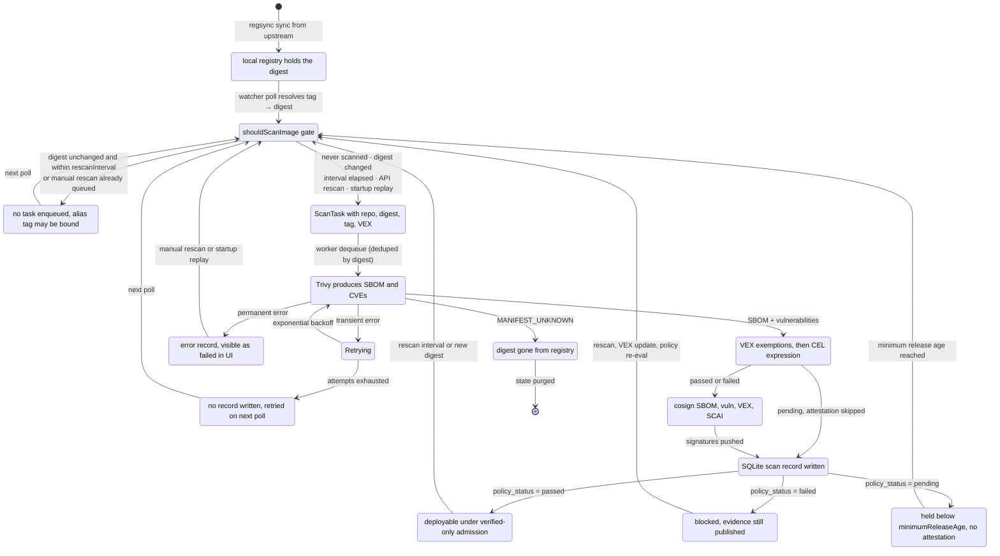
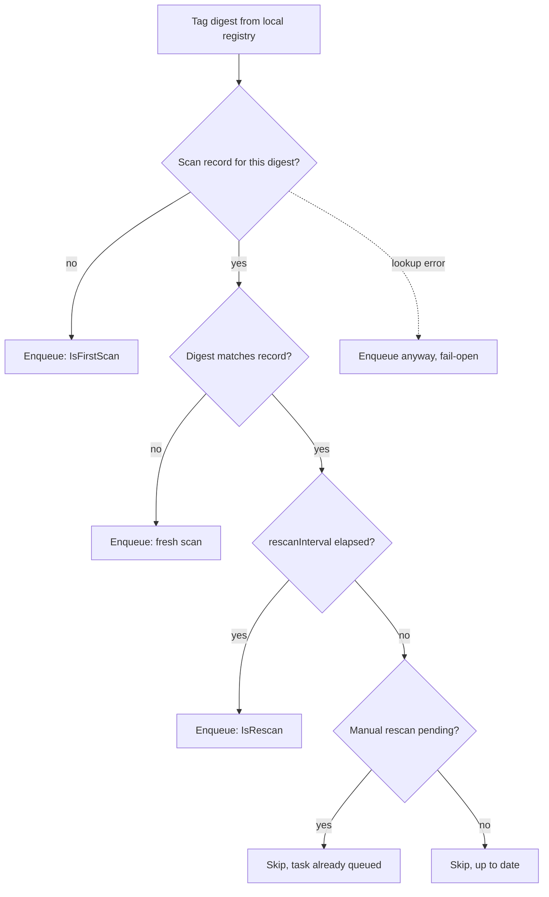

# Image Lifecycle State Machine

How a single image digest moves through suppline, from upstream registry to a policy verdict the cluster can enforce.

## Full lifecycle

## Watcher scan gate

`shouldScanImage` decides whether a polled tag becomes a queued task. It fails open: if the state lookup itself errors, the image is enqueued rather than silently skipped.

## Pipeline phases

The worker runs four phases per task. Each phase can end the task early.

| Phase | Does | Early exits |
|-------|------|-------------|
| Scan | Trivy SBOM + vulnerability scan | `MANIFEST_UNKNOWN` triggers digest cleanup; permanent errors record a failed scan |
| Evaluate | Apply active `not_affected` VEX, then the CEL expression | `pending` verdict sets `ShouldAttest=false` and skips attestation |
| Attest | cosign SBOM, vulnerability, VEX, and SCAI attestations | VEX attestation only when CVEs were exempted |
| Persist | Write scan record, vulnerabilities, tag bindings | Transient errors retry; permanent errors are logged without undoing attestations |

## Error handling

| Error class | Behavior | Resulting state |
|-------------|----------|-----------------|
| Transient | Retry with backoff up to `RetryAttempts` (default 3) | Recovers, or abandoned with no record |
| Permanent | No retry | `ScanFailed` record with `policy_status=failed` |
| Manifest not found | Cleanup of stored state for the digest | Removed from tracking |
| Unknown | Treated as permanent | `ScanFailed` |

## Policy terminals

| Status | Attested | Meaning | Typical cause |
|--------|----------|---------|---------------|
| `passed` | Yes | Gate open, deployable under verified-only admission | CEL expression true after VEX exemptions |
| `failed` | Yes | Gate closed, evidence still published for audit | CEL expression false, e.g. `criticalCount > 0` |
| `pending` | No | Held, re-evaluated on a later scan | `minimumReleaseAge` unmet or no age source available |

See [POLICY.md](POLICY.md) for CEL expressions and VEX semantics, and [CONFIGURATION.md](CONFIGURATION.md) for `rescanInterval` and `minimumReleaseAge`.
